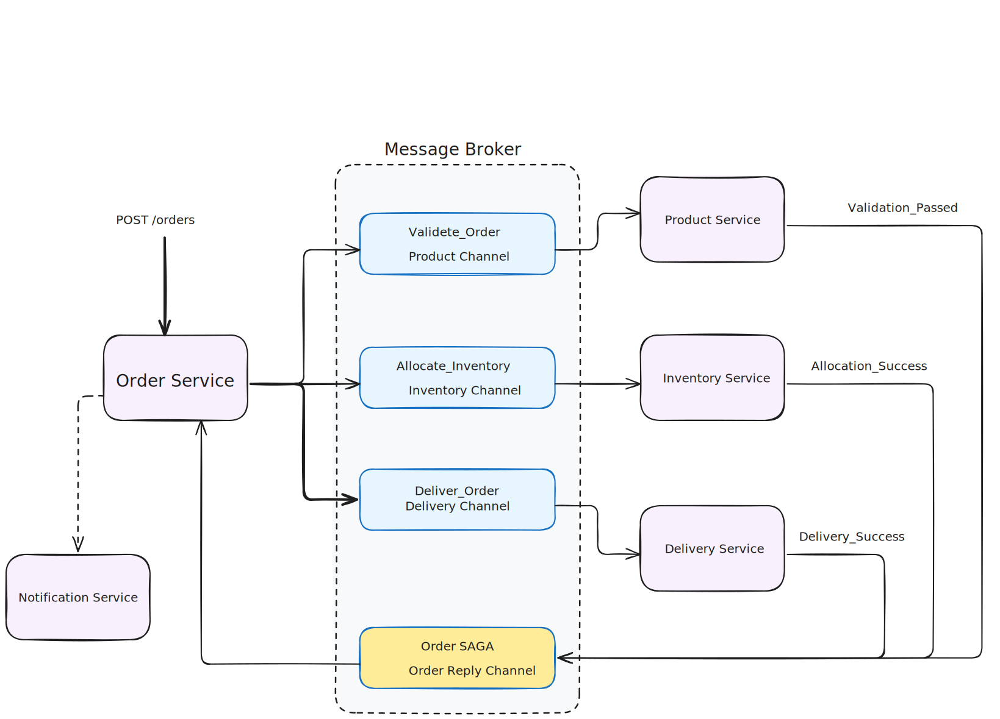
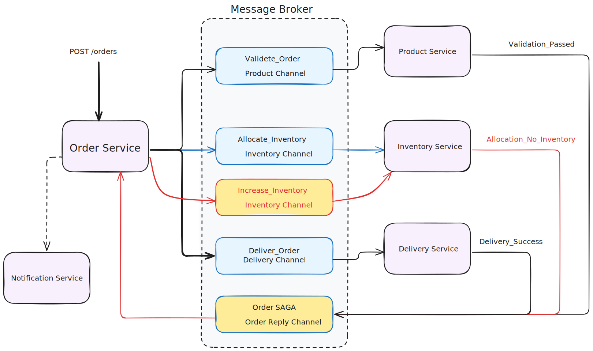

# E-commerce Microservices

- The aim of this simple project is to experience the fundamental concepts of microservices architecture.
- Spring/SpringBoot is adapted to develop each services. A message broker (RabbitMQ) is used to communicate between services.
- Each service should have its own database, and the data is not shared between services. However, in this project,
I use a shared database with different schemas for simplicity.

## State Machine and Saga Pattern used together for order process

- The ordering process is managed using a state machine, which allows the system to handle various states of an order.
- The state machine is implemented using the Spring State Machine library.
- The Saga Pattern is used to manage distributed transactions across multiple services, ensuring data consistency and reliability.
- The Saga Pattern is implemented as Command/Orchestration to manage the order process, ensuring that all steps are completed successfully or rolled back in case of failure.
- Order Service is the orchestrator of the Saga, coordinating the various steps involved in processing an order.

Here is the diagram showing the orchestration of the order process:

In case there is no stock available for the ordered product, the orchestrator triggers inventory service to manufacture more products.

Here, Inventory Service is also responsible for manufacturing the products to keep our example simple.

The Notification Service will inform the owner of the order about the order status, aka the states.

The state changes of an order and the events triggering those changes are as follows:

We could cancel the order at any time, which will trigger the cancellation process.
Also, if the state is an error state, the order will be cancelled automatically.